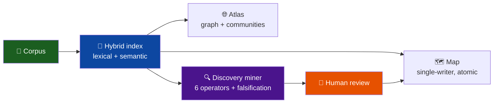
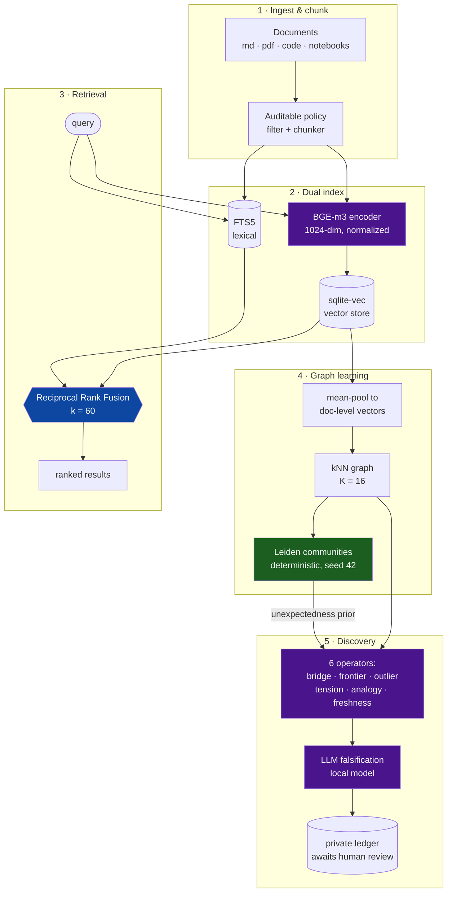
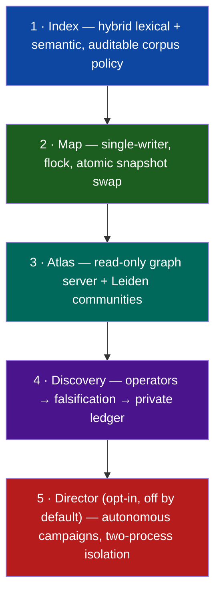

<div align="center">

# 🗺️ memoria-colectiva

### A living **semantic map** for a shared corpus — local-first, nothing leaves your machine.

*Index everything by meaning, draw the map of what's there, and surface the connections nobody noticed between documents that never cite each other.*


-555)


</div>

---

Several people — or several agents — work on the same disk, and nobody holds the whole picture. `memoria-colectiva` reads that shared corpus, builds a **hybrid semantic index** over it, compiles a navigable **atlas**, and runs a **discovery miner** that proposes non-obvious links for a human to review. The embedding model is downloaded once; after that the whole thing runs **offline** — no API call ever carries your documents off the machine.



## Table of contents

- [What it does](#what-it-does)
- [The machine-learning pipeline](#-the-machine-learning-pipeline) ← *the heart of it*
- [Architecture](#architecture)
- [Tech stack](#tech-stack)
- [Quickstart](#quickstart)
- [Security model](#security-model)
- [Under the hood](#under-the-hood)
- [Repository layout](#repository-layout)
- [Credits & license](#credits--license)

## What it does

| | Capability | How |
|---|---|---|
| 🔡 | **Search by meaning** | Hybrid retrieval: lexical (SQLite FTS5) **and** semantic (local embeddings), fused with Reciprocal Rank Fusion |
| 🗺️ | **Living map** | One node per project, recompiled by a single writer under a lock, published by atomic snapshot swap |
| 🌐 | **Visual atlas** | The document graph, colored by communities detected with the Leiden algorithm |
| 🔍 | **Surface hidden links** | Six operators sweep the vector space for latent bridges, cross-project frontiers, tensions and analogies |
| 🧪 | **No hallucinated findings** | Every candidate is put through an LLM **falsification** pass and waits in a private ledger for human review |
| 🔒 | **Stays home** | Loopback by default, kernel-level network filter, model runs offline |

---

## 🧠 The machine-learning pipeline

This is where the interesting work is. The system is, at heart, a **retrieval + graph-learning pipeline** that turns a pile of files into a navigable, minable semantic space.



### What each stage actually does

| Stage | Technique | Detail that matters |
|---|---|---|
| **Embeddings** | [`BAAI/bge-m3`](https://huggingface.co/BAAI/bge-m3) | 1024-dimensional, L2-normalized, multilingual. Runs on GPU if present, CPU otherwise. Downloaded once, then **offline**. |
| **Vector store** | [`sqlite-vec`](https://github.com/asg017/sqlite-vec) | Vectors live in the *same* SQLite file as the lexical index — no separate vector DB, no server. |
| **Lexical** | SQLite **FTS5** | Full-text with unicode-aware tokenization and diacritic folding. |
| **Fusion** | **Reciprocal Rank Fusion** (k=60) | Lexical and semantic rankings are combined by rank, not by raw score — robust to the two signals living on different scales. |
| **Selective embedding** | — | Code and config are indexed **lexically only**: a text embedder clusters them by surface tokens and poisons the semantic neighborhood. Prose gets the full treatment. |
| **Graph** | doc-level kNN, K=16 | Chunk vectors are mean-pooled per document; each doc links to its 16 nearest neighbors. |
| **Communities** | **Leiden** (via `igraph`/`leidenalg`) | Computed once per build over the collapsed undirected graph, with a **deterministic partition hash** (fixed seed + canonical renumbering) — same input, same partition. Falls back to client-side Louvain if the artifact is missing. |
| **Unexpectedness prior** | cross-community ranking | The miner evaluates first the pairs that bridge *weakly-connected* communities — a cheap, honest proxy for "surprising". It reorders, never filters. |
| **Falsification** | local LLM | Each candidate link is handed to a local model with the instruction to *refute* it. Survivors are kept; the rest are dropped. Nothing is published without a human. |

> **Why this shape?** Pure vector search finds what's *similar*; pure keyword search finds what's *named*. Fusing them, then lifting the result into a graph and detecting communities, is what lets the system answer a question no single query can — *"which two projects are quietly working on the same problem with different words?"*

---

## Architecture

Five layers. Each one consumes the previous and needs none of the next — the system is useful stopping at layer 1.



Two design decisions carry most of the weight:

- **Single writer, atomic publish.** The map is compiled by one process under `flock`, staged, then swapped in by renaming a whole directory. Readers see the old version or the new one, never a half-written one. No distributed coordination to get wrong.
- **The data has two roots.** `MAPA_ROOT` (your corpus) is separate from `CODE_HOME` (the engine), so the same code installs anywhere. The autonomous director's control plane lives outside both.

Full write-up in [`docs/arquitectura.md`](docs/arquitectura.md).

## Tech stack

| Layer | Tools |
|---|---|
| **Embeddings & ML** | `sentence-transformers` · `BAAI/bge-m3` · `torch` (CPU or CUDA) |
| **Index** | SQLite **FTS5** + [`sqlite-vec`](https://github.com/asg017/sqlite-vec) · Reciprocal Rank Fusion |
| **Graph** | `networkx` · `python-igraph` + `leidenalg` (Leiden communities) |
| **Backend** | Python 3.10+ stdlib `http.server` (read-only), `flock`-based orchestration |
| **Frontend** | React + Vite · Sigma.js / graphology · 3d-force-graph |
| **Ops** | systemd unit templates · kernel-level network filtering |

## Quickstart

```bash
git clone https://github.com/Mar-IA-no/memoria-colectiva && cd memoria-colectiva

# tells you exactly what's missing before touching anything
./scripts/preflight.sh

# core: no root, no systemd, no GPU required
./install.sh --root /path/to/your/corpus
```

`install.sh` prints the exact `<venv>` and `<code-home>` paths at the end. Then:

```bash
export MAPA_ROOT=/path/to/your/corpus
<venv>/bin/python <code-home>/tier1.py index --scope total
<venv>/bin/python <code-home>/tier1.py search "your query"
<venv>/bin/python <code-home>/serve.py        # atlas at http://127.0.0.1:8899/atlas/
```

Try it with no material of your own — there's a synthetic corpus built to show the semantic layer surfacing a latent connection:

```bash
mkdir -p /tmp/demo && cp -a examples/corpus/. /tmp/demo/ && ./install.sh --root /tmp/demo
```

<details>
<summary><b>What the demo shows</b></summary>

Fifteen synthetic documents across three fictional projects. One studies sensor calibration, another annotator agreement — each describes, in its own domain and **without referencing the other**, the same underlying problem: *measurement drift*. No project log draws the link; only an abstract note names both as instances of the same thing.

The demo corpus is in Spanish, on purpose: an English query with **zero lexical overlap** — `"losing precision over time"` — retrieves that Spanish note, *"la deriva como problema general"*, where keyword search would return nothing. That's the multilingual semantic layer at work — and the same signal the discovery miner is built to turn into a reviewable candidate.

*(Verified end-to-end on CPU: the English query returns that document.)*

</details>

## Security model

The active threat is simple: the corpus should not leave the machine. Three ways it could, three defenses:

| Risk | Defense |
|---|---|
| A service exposed to the internet | Loopback bind by default; a non-loopback bind requires an explicit opt-in **and** a kernel-level `systemd` network filter — because *an RFC1918 address is not private in the cloud* (NAT 1:1 to a public IP) |
| A process with too much reach | Read-only, no-shell service users; the corpus mounted read-only |
| Private data leaking into *this* repo | The repo is built by **allowlist**, and a `leak_check.py` gate fails on any file not declared, plus host paths, private IPs, credentials and secrets — with a negative self-test, because a guard never tested failing is not a guard |

The optional **director** runs an agent with a shell. Its isolation is by process, not by sandbox — and there are risks that isolation does *not* cover. It ships **disabled**, and [`docs/seguridad.md`](docs/seguridad.md) states them plainly before you turn it on.

## Under the hood

<div align="center">

| | |
|---|---|
| **Engine** | ~7.9k lines of Python |
| **Frontend** | ~2.2k lines of TypeScript |
| **Orchestration** | ~0.7k lines of shell |
| **Whole repo** | 88 files, under 2 MB |
| **Runtime footprint** | one SQLite file + a cached model |
| **Scale** | tens of thousands of documents |
| **Data egress** | none, by construction |

</div>

Every claim in this README is measured, not rounded up.

## Repository layout

<details>
<summary><b>Expand the tree</b></summary>

```
memoria-colectiva/
├── mapa/            engine — index, map, atlas, discovery, director, config
├── scripts/         orchestration — librarian, director, setup, preflight
├── prompts/         load-bearing agent prompts (director, librarian)
├── web/             React + Vite atlas & lab
├── systemd/         service unit templates
├── config/          sanitized example configs
├── tools/           leak-check, model bootstrap, repo builder
├── tests/           bind invariant, indirect-injection defenses
├── examples/        synthetic corpus for a zero-data demo
├── docs/            architecture · install · operation · security
└── install.sh · requirements.txt · LICENSE
```

</details>

## Credits & license

Community detection with Leiden and the *unexpectedness* ranking — evaluate first the pairs that cross weakly-connected communities — are inspired by the ideas in [Graphify](https://github.com/Graphify-Labs/graphify).

Released under the [MIT](LICENSE) license.

---

<div align="center">
<sub>Built to be read by both a human looking for the story and a machine looking for a fact.</sub>
</div>
